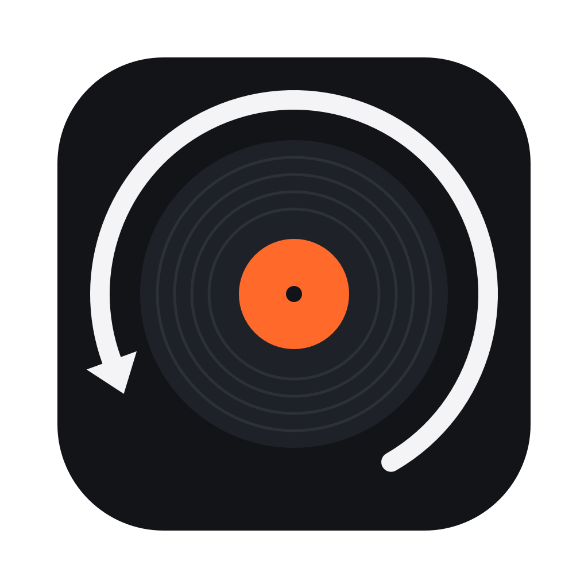

<p align="center"></p>

# Backspin

**Look after your rekordbox library, and prepare your sets faster than rekordbox lets you.**

Backspin is a desktop app for DJs who use rekordbox 6 or 7. It reads your
library, finds what is wrong with it, and helps you tag, sort, listen and
build sets, then writes the results back into rekordbox, safely.

It runs entirely on your own computer. Your library is never uploaded.

> Backspin is an independent project. It is not made by, affiliated with or
> endorsed by AlphaTheta or Pioneer DJ. "rekordbox" is their trademark.

## Download

Get the latest build from the [Releases](../../releases) page:

- **Windows**: `Backspin-windows.zip`. Unzip it and run `Backspin.exe`.
- **macOS (Apple Silicon)**: `Backspin-macos-arm64.zip`. Unzip it and drag
  `Backspin.app` to Applications. The app is not notarised yet, so the first
  time you need to right-click it and choose **Open**.

For converting files you also need **ffmpeg**: `winget install ffmpeg` on
Windows, `brew install ffmpeg` on macOS. Without it everything else still
works. On macOS, conversion falls back to the system's own `afconvert`.

## What it does

| Tab | What it is for |
|---|---|
| **Inbox** | Your tagging queue. Listen, rate, set energy and tick your MyTags one track at a time, with the three-band waveform a CDJ shows. On macOS there is also a menu bar icon, so you can tag while another window is in front. |
| **Library** | Search and filter everything, play it, and edit tags and colours in place. |
| **Find** | Check a Spotify or SoundCloud playlist against your library: what you already own, what you don't, and what is almost a match. Pair songs by hand, then make a rekordbox playlist out of it, or link the streaming playlist to one you already have and update it later. |
| **Sets** | Build a set from your own MyTag vocabulary. It follows key and tempo, and shows what you have actually mixed after what. The result is saved back as a rekordbox playlist. |
| **Import** | Scan a folder of new music, rename it to `Title - Artist`, convert FLAC to AIFF, and add it to rekordbox under a colour that means "not looked at yet". |
| **Health** | Duplicates (it compares the real quality and length, keeps the better copy and merges your tags, playlists and cues into it), quality bands, **compatibility by CDJ generation** (which players your library plays on, and exactly which files hold you back), shop branding left in your tags, and missing artwork. |
| **Teach** | Teach the library a tag ("is this Acid?") or an ordering ("which is more intense?") by answering a few questions. It analyses the audio itself (notes, key, chords, timbre, groove), learns from your answers and your existing tags, tells you how often it is right, and ranks the whole library for you to confirm. |
| **Backups** | A copy of your library every hour it changes, kept by age. Also a rekordbox XML and readable JSON version that will outlive any change to rekordbox's encryption. |

## What it will never do

These are guarantees, not intentions. They are enforced in the code:

- **It never writes while rekordbox is open.** Edits wait in a queue and are
  written as soon as rekordbox is closed.
- **It backs up before every write.**
- **It never really deletes.** Files go to the recycle bin, and tracks are
  retired in rekordbox the same way rekordbox retires them.
- **Conversions are verified sample for sample** before an original is moved
  aside.
- **Only its own window can talk to it.** The app is a small server on
  `127.0.0.1`. It refuses any request that comes from another website open in
  your browser, so a page cannot reach your library through it.

## Backspin Cloud (coming)

The app is free and open source, and will stay that way. Backspin Cloud will
be an optional paid service with two parts:

- **A hosted backup of your music**: the audio files themselves, not just
  the library.
- **Your library on your phone**: tag, organise and listen from anywhere,
  with your computer switched off. Every change waits in the cloud and goes
  into rekordbox the next time Backspin runs on your computer.

## Run from source

Python 3.9 or newer.

```bash
git clone https://github.com/eruizimade/backspin.git
cd backspin
python3 convertidor.py        # Windows: py convertidor.py, or double-click Backspin.bat
```

On the first run a local `.venv` is created and the dependencies are installed
into it. Your browser then opens at `http://127.0.0.1:8765`. For the desktop
window instead of a browser tab:

```bash
.venv/bin/python desktop.py   # after `pip install pywebview` in that .venv
```

On macOS, `app/build.sh` builds a native window (`Backspin.app`) that runs this
folder.

To build the packaged app yourself: `pip install -r requirements.txt pyinstaller`,
then `pyinstaller backspin.spec`. The GitHub workflow in `.github/workflows`
does this for Windows and macOS on every push, and checks that the result
starts.

## Settings

Plain JSON in your app folder (`~/.config/backspin/settings.json`, or
`%APPDATA%\Backspin\settings.json` on Windows). Delete the file and every
default comes back.

| Setting | What it does |
|---|---|
| `library_db` | Where your rekordbox database is. Leave it empty and Backspin finds it, which also covers a library on an external drive. |
| `library_key` | Only needed if a future rekordbox changes its encryption key. |
| `ready_color` | The rekordbox colour that means "ready to play". Empty means every track counts. |
| `energy_in_comment` | Reads a leading number in the comment (`6 - dark roller`) as an Energy column. |
| `genre_fixes` | Your own genre spelling corrections, e.g. `{"Reggeaton": "Reggaeton"}`. |

## How it reads rekordbox

The library (`master.db`) is SQLCipher-encrypted with a passphrase that is
public and used by [pyrekordbox](https://github.com/dylanljones/pyrekordbox).
Every read happens on a temporary copy, so rekordbox is never locked by one.
Waveforms are not computed here: they are read from the analysis rekordbox
already stored next to every track (the `PWV6` section of the `.2EX` file),
which is why they match a CDJ exactly.

## Licence

[GPL-3.0](LICENSE). You may use, study, change and share it. If you
distribute a changed version, its source has to be available under the same
licence.
